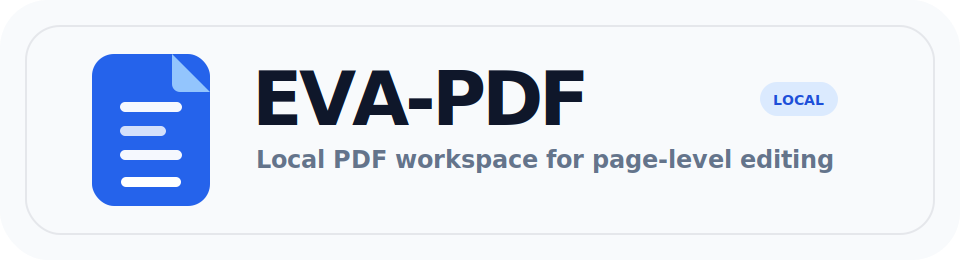
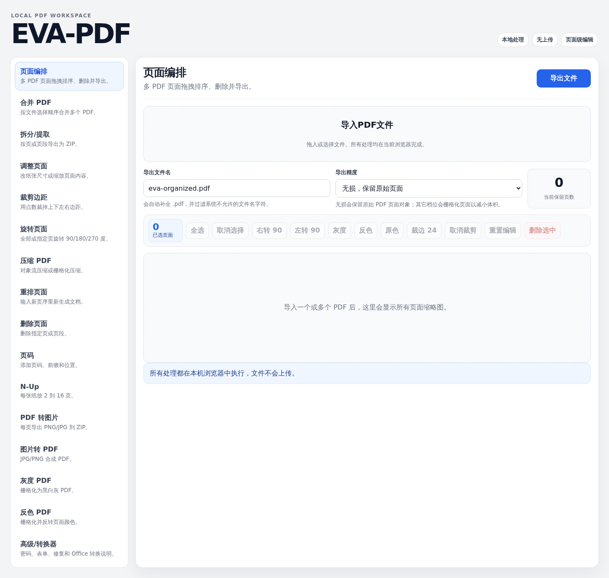

# EVA-PDF



EVA-PDF 是一个本地优先的 PDF 页面编排与编辑工具。应用以浏览器页面运行，文件在当前设备内处理，不上传到远程服务器。



## 核心能力

- 导入多个 PDF，按页面生成预览缩略图
- 拖拽页面重新排序，删除单页或批量删除选中页面
- 支持页面选中、多选、全选和批量操作
- 对选中页面执行旋转、裁剪、灰度、反色和重置编辑
- 自定义导出文件名，并选择无损、高清、均衡或小体积导出

## 附加工具

- 合并 PDF、拆分/提取页面、重排页面、删除页面
- 调整页面尺寸、裁剪边距、旋转页面、添加页码
- N-Up 排版、PDF 压缩、PDF 转图片、图片转 PDF
- PDF 灰度化、反色处理

## 导出精度

- `无损`：优先复制原始 PDF 页面对象，适合保持文本和矢量内容质量。
- `高清`：页面栅格化为高分辨率图像，适合打印或需要应用改色效果的页面。
- `均衡`：在清晰度和文件体积之间折中。
- `小体积`：优先减小文件，适合快速分享和预览。

灰度和反色属于像素级操作。即使选择无损导出，应用也会只对这些被改色的页面进行栅格化处理。

## 本地运行

Agent 或远程环境可直接参考 [Agent 一键安装](AGENT_INSTALL.md)。

```bash
npm install
npm run dev
```

启动后打开 Vite 输出的本地地址，通常为 `http://localhost:5173/`。

## 构建

```bash
npm run build
```

构建产物输出到 `dist/`。

## 环境说明

如果在 WSL 中只有 Windows 版 Node/npm，Vite 可能因 `\\wsl.localhost` UNC 路径无法正常构建或监听文件。建议在 WSL 内安装 Linux 版 Node.js，或将项目放到 Windows 盘符路径后运行。

## 当前限制

- 密码保护、移除密码和权限控制需要接入本机 `qpdf` 等服务端工具。
- Office/电子书格式转换需要接入 LibreOffice、Calibre 或专用转换器。
- 损坏 PDF 修复、交互式表单填写和原始嵌入图片抽取需要更底层 PDF 解析能力。

## Star History

[](https://www.star-history.com/#ShawnPi233/EVA-PDF&Date)
